# บทที่ 3 วิธีการจัดทำ TMLT Mapping

ในบทนี้ประกอบด้วยขั้นตอนการจัดทำ TMLT Mapping โดยมีวิธีการดำเนินการดังนี้

---

## 3.1 การสร้าง Mapping

เจ้าหน้าที่หน่วยบริการสามารถสร้าง TMLT Mapping เพื่อเชื่อมโยง **รหัสการตรวจทางห้องปฏิบัติการของหน่วยบริการ (Lab code)** เข้ากับ **รหัสมาตรฐานการตรวจทางห้องปฏิบัติการทางการแพทย์ไทย (รหัส TMLT)** โดยสามารถสร้างได้ 2 วิธี ดังนี้

---

### 3.1.1 สร้างโดยการนำเข้าไฟล์ Excel

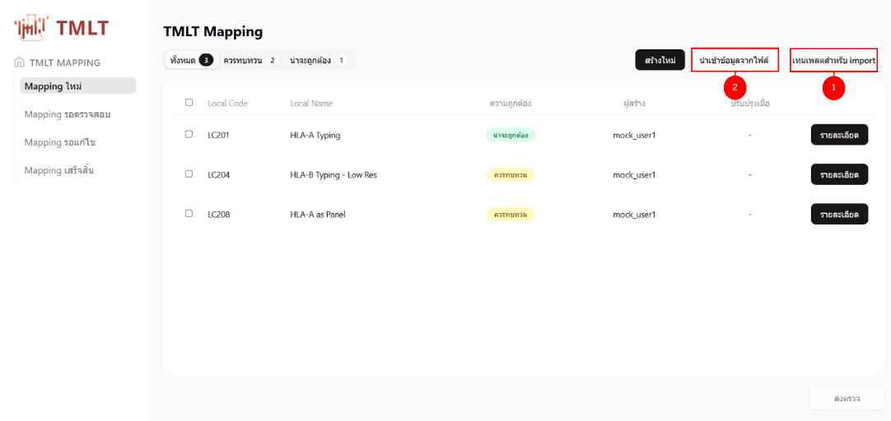

1. เลือกข้อความ **"เทมเพลตสำหรับ import"** สำหรับการดาวน์โหลดเทมเพลตที่ใช้ในการกรอก mapping และนำเข้าสู่ระบบ โดยจะต้องกรอกข้อมูลในช่องที่บังคับให้กรอกครบทุกช่อง จึงจะสามารถนำเข้าไฟล์ได้ โดยข้อมูลที่จำเป็นต้องกรอกคือ

   1.1. ช่องกรอกรหัสการตรวจแล็บของหน่วยบริการ (LAB_CODE)

   1.2. ช่องเลือกสถานที่ตรวจ โดยมีให้เลือกคือ ตรวจเองและส่งตรวจภายนอก (LOCATION)

   1.3. ประเภทการตรวจทางห้องปฏิบัติการฯของหน่วยบริการ (LAB_TYPE) โดยมีให้เลือกคือ การตรวจที่เป็นรายการ (ITEM) หรือ การตรวจเป็นชุด (PANEL)

   1.4. TMLT Code: รหัส TMLT ที่ต้องการ Mapping

   1.5. Local name: ชื่อการตรวจของหน่วยบริการ (LAB_NAME) เช่น FBS

   1.6. Component: การตรวจนี้เป็นการตรวจเพื่อหาอะไร หรือต้องการตรวจวัดอะไร

   1.7. Specimen: ประเภทของสิ่งส่งตรวจ เช่น Serum or Plasma, Sputum หรือ Urine เป็นต้น (จำเป็นต้องกรอก หากไม่มีให้ระบุ N/A)

   1.8. Scale: ชนิดของการวัด หรือรูปแบบการรายงานผล เช่น Quantitative (จำเป็นต้องกรอก หากไม่มีให้ระบุ N/A)

   1.9. Unit: หน่วยของการวัด เช่น mg/dL, g/dL หรือ mol/L เป็นต้น (จำเป็นต้องกรอก หากไม่มีให้ระบุ N/A)

2. เลือกปุ่ม **"นำเข้าข้อมูลจากไฟล์"** เลือกไฟล์ที่ผู้ใช้งานได้ดาวน์โหลดและทำการเพิ่ม TMLT mapping แล้ว เมื่อนำเข้าสู่ระบบ จะแสดงสถานะตอนนำเข้า มีทั้งหมด 3 แบบ ได้แก่

   | สถานะ | ความหมาย |
   |---|---|
   | ✅ **น่าจะถูกต้อง** | รหัสการตรวจฯ (Lab code) มีรายละเอียดต่างๆ ตรงกับรหัส TMLT ที่เลือก |
   | ⚠️ **ควรทบทวน** | รายละเอียดบางส่วนหรือทั้งหมดไม่ตรงกับรหัส TMLT แต่ระบบยังอนุญาตให้นำเข้าได้ |
   | ❌ **มีข้อผิดพลาด** | ระบบไม่สามารถนำเข้าไฟล์ได้ ต้องแก้ไขก่อน |

:::warning คำเตือน
ระบบไม่อนุญาตให้นำเข้าไฟล์นั้นๆ ได้ จนกว่าจะมีการแก้ไขข้อผิดพลาดตามที่ระบบแจ้งจนครบถ้วน

**สาเหตุที่พบบ่อย:**
- ไฟล์ Excel มีหัวตารางไม่ตรงกับเทมเพลต
- มีรหัสการตรวจแล็บซ้ำกันในไฟล์
- รายการที่นำเข้ารหัสการตรวจแล็บแล้ว และรายการดังกล่าวอยู่สถานะ "รอตรวจ"
:::

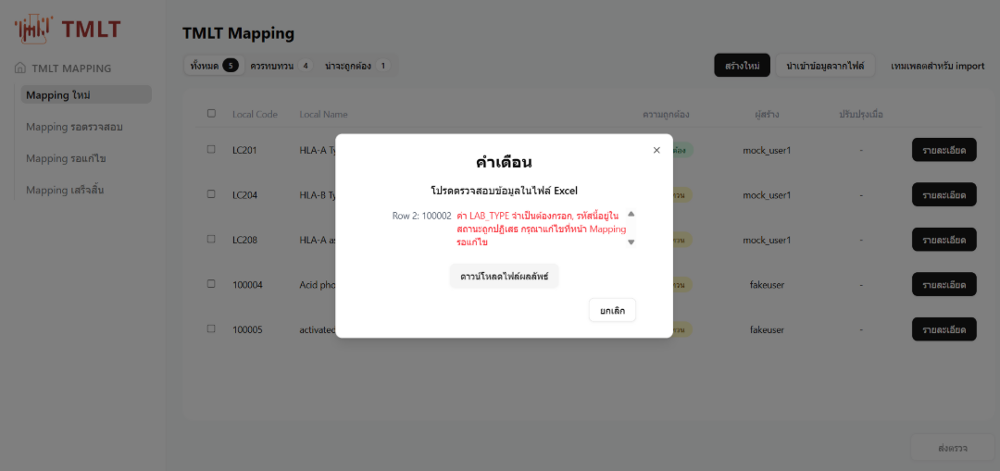

โดยเมื่อระบบตรวจพบข้อมูลที่มีสถานะควรทบทวนและมีข้อผิดพลาด ระบบจะทำการแสดงเหตุผลที่ทำให้เกิดสถานะนั้นๆ พร้อมมีปุ่มดาวน์โหลดไฟล์ที่จะระบุข้อควรทบทวนหรือข้อผิดพลาด ในระดับแถวตาราง เพื่อความสะดวกของผู้ใช้งานในการแก้ไข

ภาพแสดงตัวอย่างการแจ้งเตือนข้อผิดพลาดจากระบบ TMLT
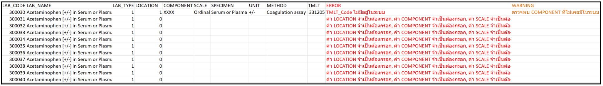
ภาพตัวอย่างไฟล์ที่แสดง Error กับ Waring ที่ดาวน์โหลด

---

### 3.1.2 สร้าง Mapping ผ่านฟอร์มในระบบ

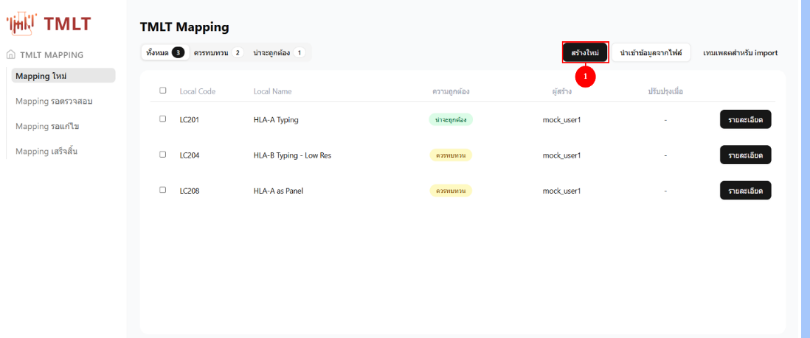

1. เลือกปุ่ม **"สร้างใหม่"** เพื่อเข้าสู่หน้าฟอร์มการสร้าง TMLT mapping โดยรายละเอียดแต่ละช่อง สามารถดูได้ที่สัญลักษณ์ **ⓘ** โดยจะแสดงคำอธิบายของแต่ละช่อง

:::caution จุดสำคัญ
หากต้องการทราบรายละเอียดของแต่ละช่อง ให้กดที่สัญลักษณ์ **ⓘ** หน้าช่องนั้นๆ
:::

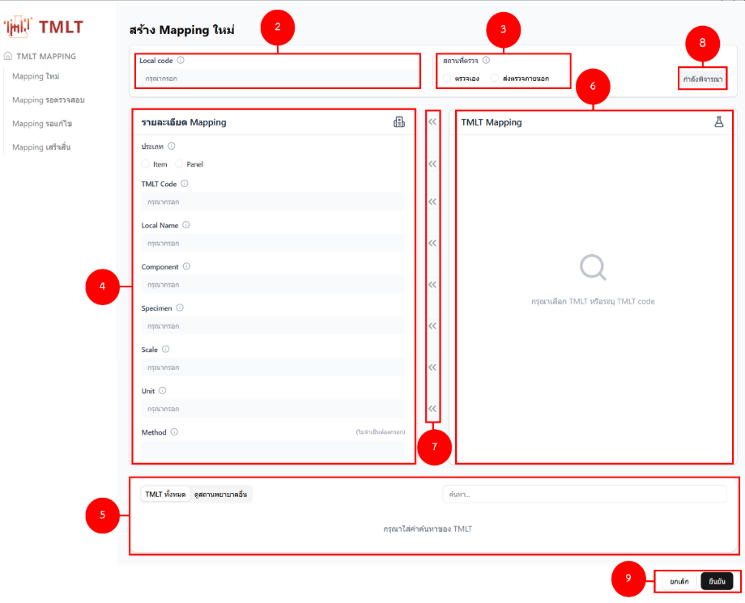

2. หมายเลข 2 คือ ช่องกรอกรหัสการตรวจแล็บของหน่วยบริการ หรือ Local code (จำเป็นต้องกรอก) หากมี Local Code ดังกล่าวอยู่แล้วในระบบ จะมีการแจ้งเตือนให้ทราบ "Local code XXXX ถูกใช้ในระบบแล้ว"

   2.1 Lab Code นั้นมีสถานะผ่านแล้ว (Approved) ระบบจะแสดงข้อความแจ้งเตือน “พบรหัส Lab Code ซ้ำ Lab Code: XXXXXX มี Mapping ที่ Approved แล้วอยู่ในระบบ ต้องการสร้าง Mapping นี้อีกครั้งหรือไม่? แต่ถ้าหากยืนยันว่าต้องการทำรายการนี้ใหม่ ให้กด “ยืนยัน” 
  
   2.2 Lab Code นั้นมีสถานะรอตรวจ ระบบจะแสดงข้อความแจ้งเตือน **“Local code: 100011 ถูกใช้ในระบบแล้ว”** จะไม่สามารถแก้ไข จะไม่สามารถแก้ไขได้ จนกว่า Admin จะตรวจสอบ 

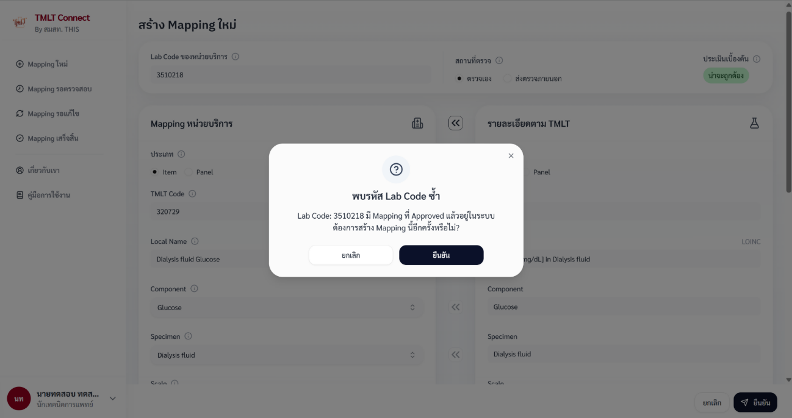

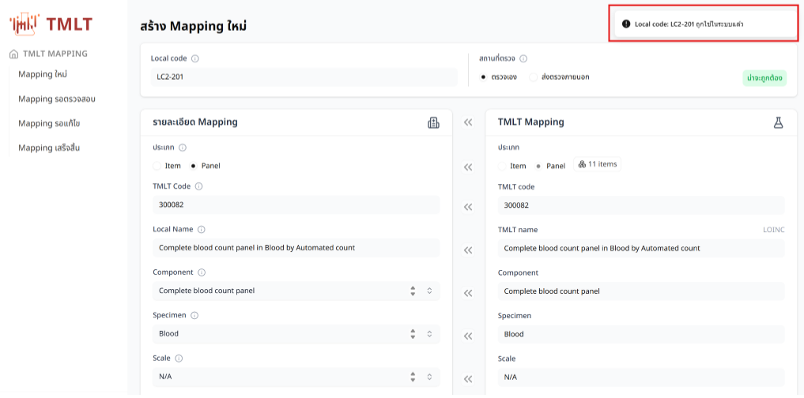

3. หมายเลข 3 คือ ช่องเลือกสถานที่ตรวจ โดยมีให้เลือกคือ ตรวจเองและส่งตรวจภายนอก (จำเป็นต้องกรอก)

4. ช่องกรอกรายละเอียดของ mapping ฝั่งรหัสการตรวจทางห้องปฏิบัติการฯของหน่วยบริการ (Lab code) โดยสามารถเลือกจาก Dropdown หรือสามารถพิมพ์เองได้ ประกอบด้วย

   | ข้อ | ช่อง | รายละเอียด |
   |---|---|---|
   | 4.1 | ประเภท | การตรวจที่เป็นรายการ (ITEM) หรือ การตรวจเป็นชุด (PANEL) (จำเป็นต้องกรอก) |
   | 4.2 | TMLT Code | รหัส TMLT ที่ต้องการ Mapping (จำเป็นต้องกรอก) |
   | 4.3 | Local name | ชื่อการตรวจของหน่วยบริการ เช่น Fasting blood glucose (จำเป็นต้องกรอก) |
   | 4.4 | Component | การตรวจนี้เป็นการตรวจเพื่อหาอะไร หรือต้องการตรวจวัดอะไร (จำเป็นต้องกรอก) |
   | 4.5 | Specimen | ประเภทของสิ่งส่งตรวจ เช่น Serum or Plasma, Urine (จำเป็นต้องกรอก หากไม่มีให้ระบุ N/A) |
   | 4.6 | Scale | รูปแบบการรายงานผล เช่น Quantitative (จำเป็นต้องกรอก หากไม่มีให้ระบุ N/A) |
   | 4.7 | Unit | หน่วยของการวัด เช่น mg/dL, g/dL (จำเป็นต้องกรอก หากไม่มีให้ระบุ N/A) |
   | 4.8 | Method | วิธีการตรวจ เช่น Immunoassay, NAA with probe detection |

5. หมายเลข 5 คือ ช่องค้นหาและเลือกข้อมูลขึ้นมาเปรียบเทียบกับข้อมูลในข้อ 4 โดยสามารถเลือกได้สองแบบ ได้แก่

   - **อ้างอิงตามรหัส TMLT** สามารถค้นหาได้จาก TMLT code, TMLT name, component, specimen, scale, unit, method, LOINC code และ CGD code
   - **อ้างอิงตาม mapping ของหน่วยบริการอื่น** สามารถค้นหาได้จาก รหัสหรือชื่อของหน่วยบริการ, TMLT code, TMLT name, component, specimen, scale, unit, method, LOINC code และ CGD code

   โดยเมื่อทำการเลือกแท็บของประเภทข้อมูลที่ต้องการอ้างอิง และทำการกรอกค่าลงในช่องค้นหา ระบบจะแสดงดังภาพต่อไปนี้

   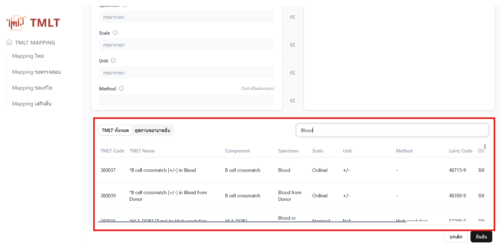

6. หมายเลข 6 คือ ช่องแสดงข้อมูลที่จะทำการแสดงข้อมูลจากการกดรายการอ้างอิงที่ต้องการจากข้อที่ 5 โดยเมื่อกดรายการแล้ว ระบบจะแสดงดังภาพต่อไปนี้

   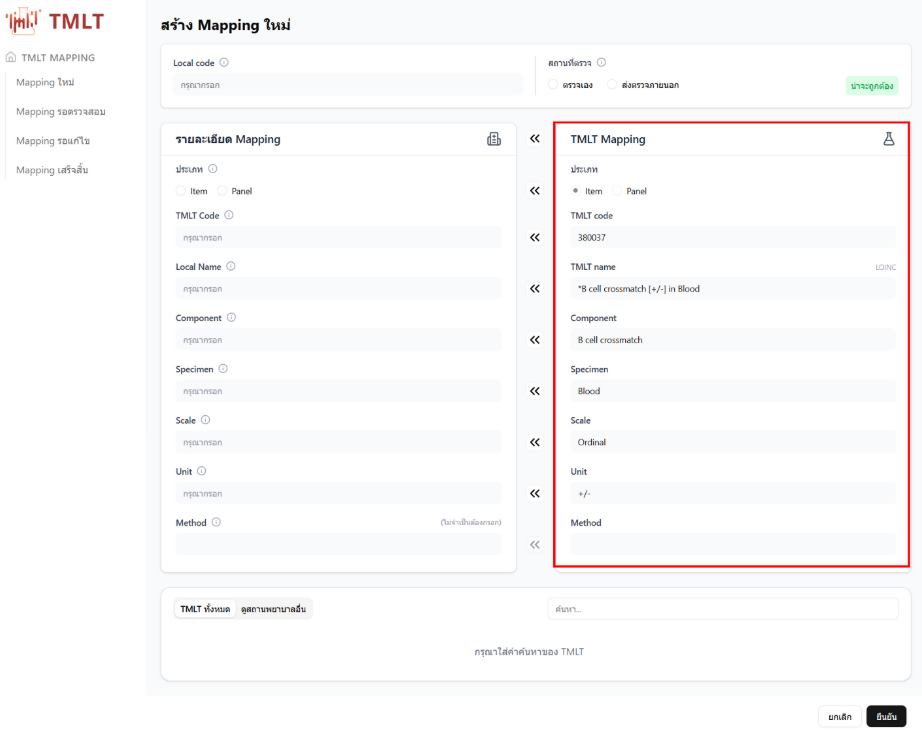

7. หมายเลข  7 คือ ปุ่มสำหรับทำการเลือกข้อมูลอ้างอิงจากข้อ 6 มาแทนค่าในช่องข้อมูลของข้อ 5 โดยหลังจากกดแล้วปุ่มสำหรับย้ายข้อมูลจะไม่สามารถกดได้อีก จนกว่าค่าทั้งสองฝั่งจะไม่เท่ากัน แต่ยังสามารถแก้ไข รายละเอียด Mapping ได้ ดังภาพตัวอย่างที่แสดงดังต่อไปนี้

   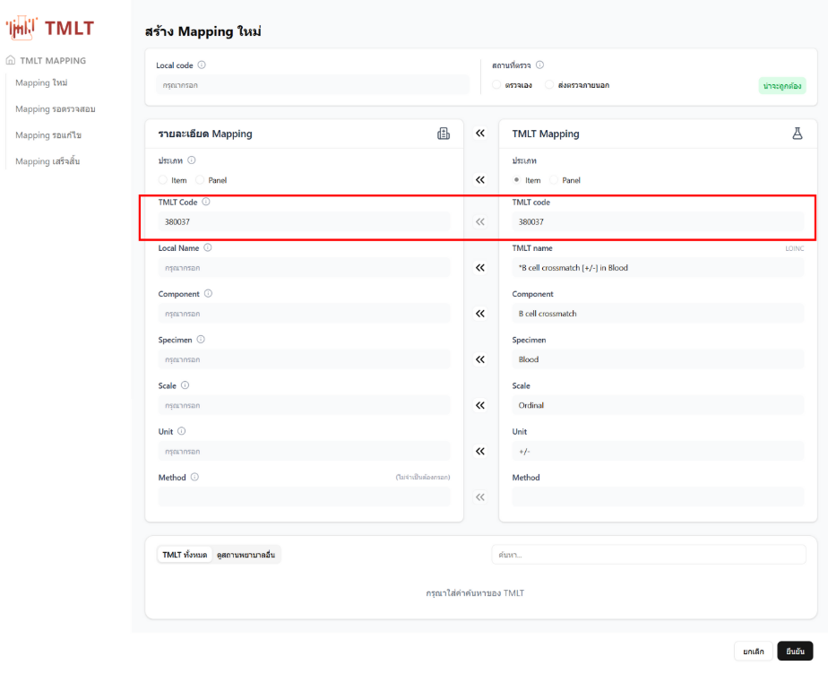

8. หมายเลข 8 คือ กล่องแสดงสถานะการเปรียบเทียบระหว่าง mapping ระหว่างข้อ 4 และ ข้อ 6 โดยหากยังไม่เลือกข้อมูลมาอ้างอิง กล่องจะแสดงสถานะ "กำลังพิจารณา" แต่หากเลือกแล้วระบบจะแสดงสถานะ "น่าจะถูกต้อง" หรือ "ควรทบทวน" ขึ้นอยู่กับความถูกต้องของข้อมูล

9. หมายเลข 9 คือ ปุ่ม **"ยกเลิก"** เพื่อยกเลิกการสร้าง หากกดยกเลิกข้อมูลจะ**ไม่ถูกบันทึกไว้** และ ปุ่ม **"ยืนยัน"** เพื่อยืนยันการสร้าง mapping

10. หากกรอกข้อมูลช่องที่จำเป็น**ครบถ้วน**จะสามารถ **"บันทึก"** ได้ แต่หากกรอกไม่ครบ ระบบจะ**ไม่ให้บันทึก** และแสดงกรอบสีแดงในช่องที่ยังไม่ได้ระบุรายละเอียด ดังภาพ

    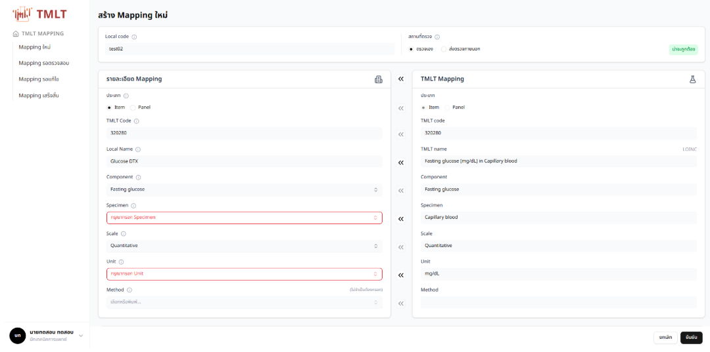

---

## 3.2 วิธีแก้ไข Mapping ที่ยังไม่ได้ส่งตรวจ

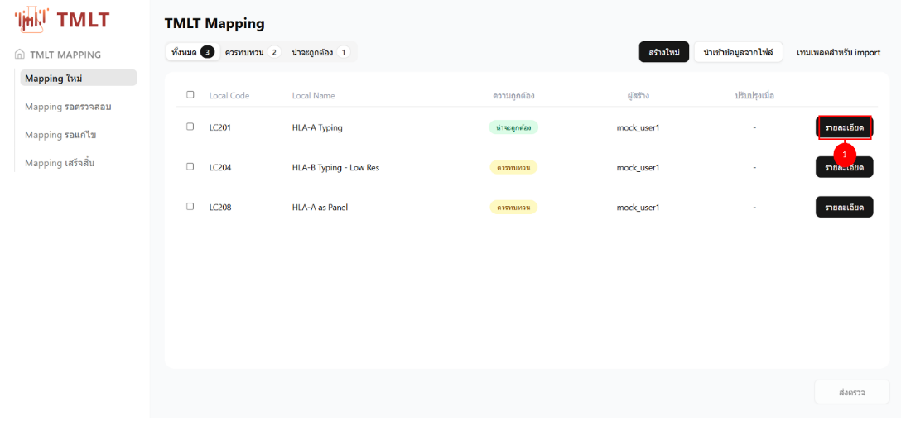

1. เลือกปุ่ม **"รายละเอียด"** สำหรับ mapping ที่ต้องการแก้ไข

   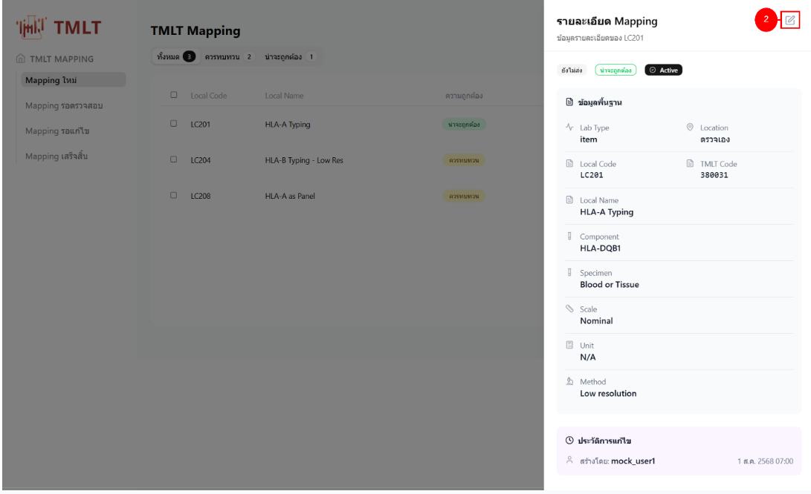

2. ระบบจะแสดงส่วนรายละเอียดของ mapping พร้อมไอคอนแก้ไข mapping **หมายเลข 2** ทางด้านขวาบนของส่วนแสดงรายละเอียด ของ Mapping และประวัติการแก้ไข โดยเมื่อกดไอคอน ระบบจะเข้าสู่หน้าแก้ไข mapping

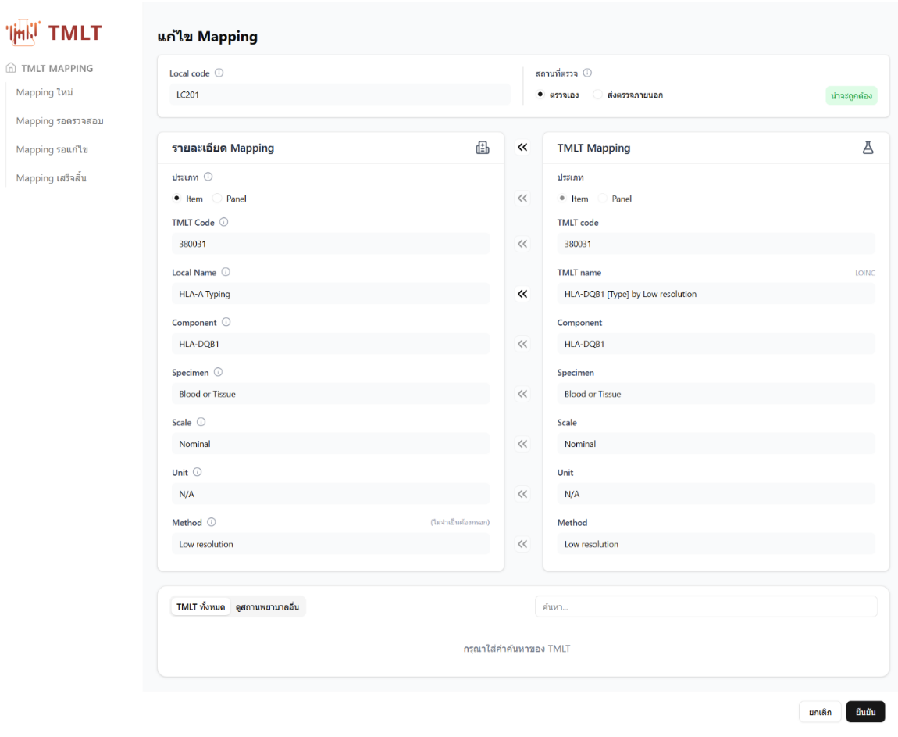

3. หน้าแสดงฟอร์มการแก้ไข mapping โดยระบบจะดึงข้อมูลรายละเอียดของรหัส TMLT ที่ mapping นั้นๆ อ้างอิงมาแสดงในส่วนของ TMLT Mapping โดยอัตโนมัติเพื่อความสะดวกในการเทียบข้อมูล โดยหากเป็นรายการ mapping ที่ยังไม่ได้ส่งตรวจสอบ จะสามารถแก้ไขได้ทุกช่องข้อมูล

:::tip
4. เมื่อแก้ไขเรียบร้อย ให้กดปุ่ม **"ยืนยัน"** หากต้องการบันทึกข้อมูล และกดปุ่ม **"ยกเลิก"** หากไม่ต้องการบันทึกข้อมูล
:::

---

## 3.3 วิธีส่ง mapping เพื่อให้เจ้าหน้าที่ สมสท. ตรวจสอบ

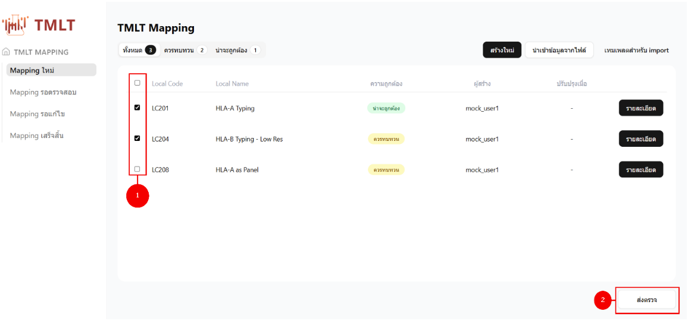

   1. ทำการเลือกกล่องตัวเลือกสำหรับรายการ mapping ที่ต้องการส่งให้เจ้าหน้าที่ สมสท. ตรวจสอบ โดยสามารถเลือกทั้งแบบทีละรายการหรือเลือกทั้งหมด

   2. เลือกปุ่ม “ส่งตรวจ” เพื่อทำการส่งรายการ mapping ที่เลือกให้เจ้าหน้าที่ สมสท. ตรวจสอบ

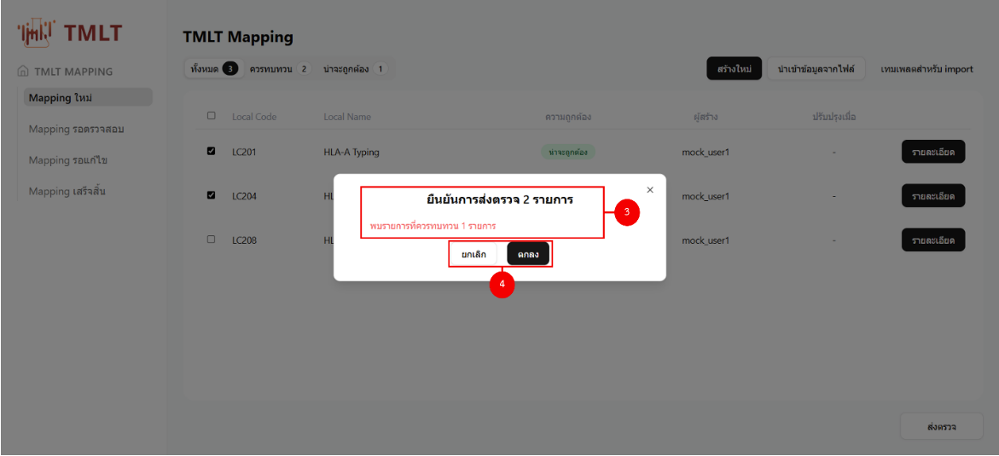

   1. เมื่อกดปุ่ม **"ส่งตรวจ"** ระบบจะแสดงหน้าต่างยืนยันการส่งตรวจ โดยส่วนที่แสดงคือ
      - จำนวนรายการ mapping ทั้งหมดที่ส่งตรวจ
      - จำนวนรายการ mapping ที่มีสถานะ "ควรทบทวน"

   2. ปุ่มทางเลือกสำหรับเจ้าหน้าที่หน่วยบริการ เพื่อยกเลิก หรือ ยืนยันการส่งตรวจ โดยหากเลือกยืนยันการส่งตรวจ mapping ทั้งหมดที่เลือกจะเปลี่ยนสถานะเป็น "รอตรวจสอบ"

   3. หากรายการ mapping ที่บางรายการมีสถานะเป็น **Approved** แล้ว จะมีข้อความแสดงให้ทางหน่วยบริการรับทราบเพื่อป้องกันการส่งซ้ำโดยไม่ตั้งใจ แต่ทั้งนี้หากหน่วยบริการยืนยันที่จะส่งรายการดังกล่าวซ้ำ สามารถกดปุ่ม **"ยืนยัน"** เพื่อส่งซ้ำได้
   4. ปุ่มทางเลือกสำหรับเจ้าหน้าที่หน่วยบริการ เพื่อยกเลิก หรือ ยืนยันการส่งตรวจ โดยหากเลือกยืนยันการส่งตรวจ mapping ทั้งหมดที่เลือกจะเปลี่ยนสถานะเป็น “รอตรวจสอบ”

   5.หากรายการ TMLT รายการ mapping ที่บางรายการมีสถานะเป็น Approved แล้ว จะมีข้อความแสดงให้ทางหน่วยบริการรับทราบเพื่อป้องกันการส่งซ้ำโดยไม่ตั้งใจ แต่ทั้งนี้หากหน่วยบริการยืนยันที่จะส่งรายการดังกล่าวซ้ำ สามารถกดปุ่ม “ยืนยัน” เพื่อส่งซ้ำได้

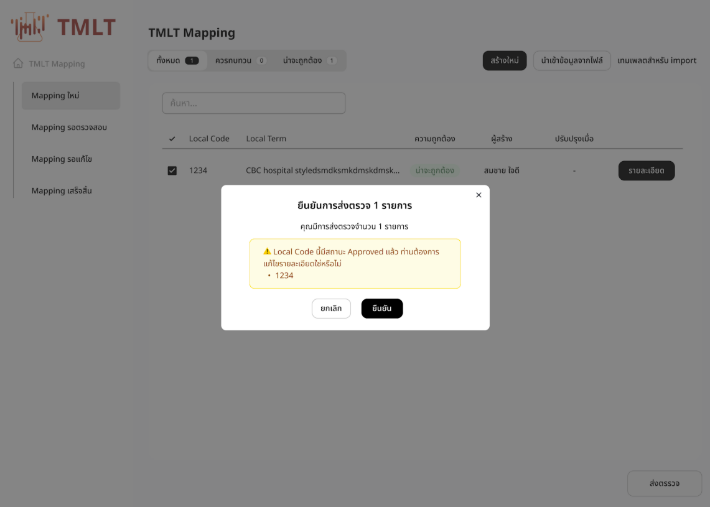

:::warning หมายเหตุ
กรณีที่ส่งรายการที่มีสถานะ **Approved** มาให้ทาง สมสท. ตรวจสอบซ้ำ หากรายการดังกล่าวมีการจัดทำ Lab Catalogue แล้ว จะต้องจัดทำ **Lab Catalogue ใหม่อีกครั้ง**
:::

---

## 3.4 วิธีการลบ Mapping

การลบ Mapping จะสามารถทำได้เฉพาะกรณีที่รายการดังกล่าวเป็น “Mapping ใหม่ หรือ Mapping รอแก้ไข” ซึ่งเป็นรายการที่รอส่งมาให้ทาง สมสท. ตรวจสอบเท่านั้น หากมีสถานะ “Mapping รอตรวจสอบ หรือ “ Mapping เสร็จสิ้น” จะไม่สามารถลบได้ รายละเอียด ดังภาพ
